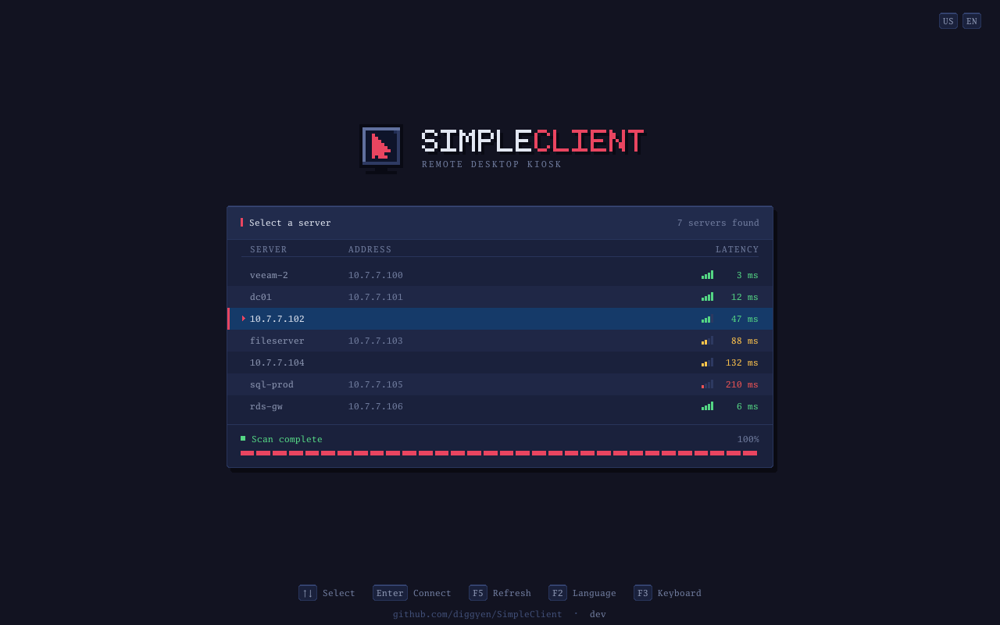
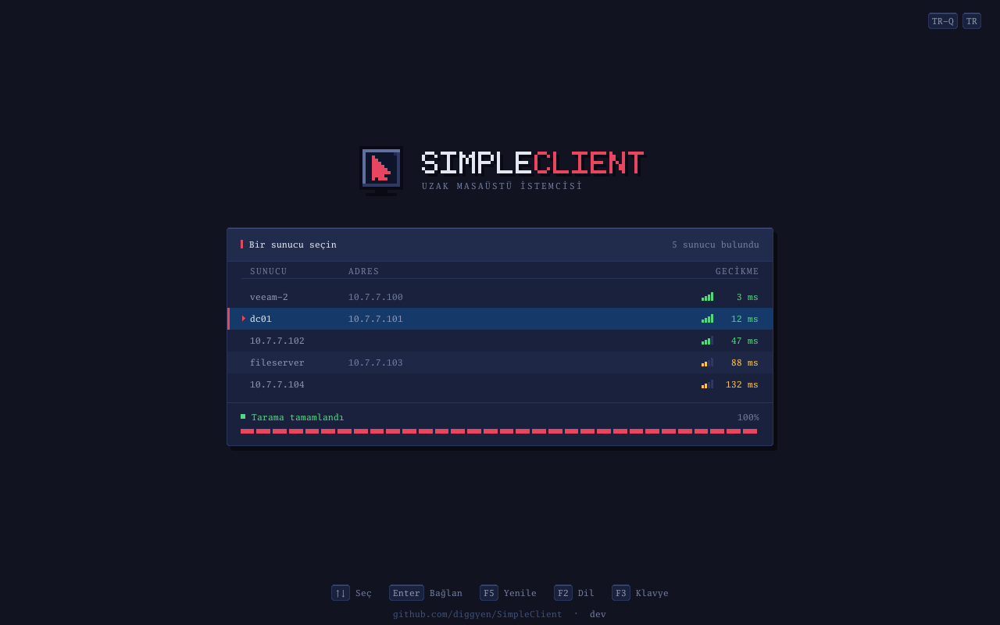

# SimpleClient

A bootable remote-desktop kiosk. Boot it on a machine, it scans the local
network for RDP hosts, you pick one, and it connects — full screen, no desktop
environment underneath.



It draws straight to the Linux framebuffer (`/dev/fb0`) and reads raw evdev
input. There is no X11 and no Wayland: the whole system is a kernel, busybox and
one static Go binary in an initramfs, about 40 MB of ISO. Every pixel above —
the mark, the lettering, the signal bars — is drawn by the binary itself; there
is no toolkit and no image asset in the ISO.

The UI ships in **English** (default) and **Türkçe**. Pick one from the boot
menu, or press **F2** at any time to switch.



Every screen is in [`docs/screenshots/`](docs/screenshots), including the
credential dialog, the empty and error states, and a capture of the real thing
booting under QEMU.

## Get it

Download `simpleclient.iso` from the
[latest release](https://github.com/diggyen/SimpleClient/releases/latest) and
write it to a USB stick:

```sh
# Linux
sudo dd if=simpleclient.iso of=/dev/sdX bs=4M status=progress conv=fsync

# macOS  (diskutil list to find the number; use rdiskN, not diskN)
diskutil unmountDisk /dev/diskN
sudo dd if=simpleclient.iso of=/dev/rdiskN bs=4m
sync
```

Verify it first if you like: `shasum -a 256 -c SHA256SUMS`.

Boots on UEFI and legacy BIOS machines. **Secure Boot must be off** — the
bootloader is unsigned, and a machine enforcing Secure Boot refuses the stick
without printing anything, which looks exactly like an empty drive. If it does
not boot, [TROUBLESHOOTING.md](docs/TROUBLESHOOTING.md#the-usb-stick-does-not-boot)
walks through the causes in order of likelihood.

## Use it

| Key | Action |
| --- | --- |
| `↑` `↓` `PgUp` `PgDn` | Move through the host list |
| `Enter` | Open the credential dialog for the selected host |
| `Tab` | Move between username / password / domain / buttons |
| `Esc` | Close the dialog |
| `F5` | Rescan the network |
| `F2` | Switch language (English ⇄ Türkçe), and the keyboard layout with it |
| `F3` | Switch keyboard layout on its own (US ⇄ TR-Q ⇄ TR-F) |
| `Ctrl`+`Alt`+`End` | Disconnect from an active session |

The scan probes TCP port 3389 across the subnet the machine got from DHCP. If
there is no DHCP server it falls back to a link-local address and scans that.
Each host is listed with the round trip of that handshake, graded onto four
signal bars, so a link too slow to work as a desktop session is visible before
you connect to it rather than after.

The two caps in the top-right corner show the active keyboard layout and
language. Choosing Türkçe — from the boot menu or with `F2` — selects the
Turkish Q layout with it; `F3` overrides that if your keyboard says otherwise.
The layout applies to the credential dialog only: inside a session the raw
keycode is forwarded and the remote machine applies its own.

Once a host has been connected to, its username and domain are filled in the
next time you open its dialog, with the cursor in the password field. That
memory lives in RAM and is gone after a power cycle — the image boots read-only
and has nowhere to write. The password is never stored.

The kiosk reaches **its own subnet only**. There is no box to type an address
into, and a server elsewhere on the network cannot be connected to at all.

## Build it

Needs Docker. The kernel, initramfs and ISO are produced inside the build
container, so the result is the same on macOS, Linux and CI.

```sh
make -f build/Makefile iso     # -> dist/simpleclient.iso
make -f build/Makefile binary  # -> dist/simpleclient (static, linux/amd64)
make -f build/Makefile test
```

You do not need spare hardware to try it — QEMU boots the same image that goes
on the stick:

```sh
bash build/test-qemu.sh                  # opens a window
bash build/test-qemu.sh --fake-rdp       # plus a host that appears in the list
```

[DEVELOPMENT.md](docs/DEVELOPMENT.md) covers the rest: iterating on the UI
without booting anything, the four boot combinations to run before trusting an
image, testing against a real RDP server, and cutting a release.

## Documentation

- **[ARCHITECTURE.md](docs/ARCHITECTURE.md)** — how the image boots, how the UI
  is drawn, how devices are found, and the decisions behind each
- **[DEVELOPMENT.md](docs/DEVELOPMENT.md)** — building, testing, releasing
- **[TROUBLESHOOTING.md](docs/TROUBLESHOOTING.md)** — symptom to diagnosis, and
  how to read the serial console

## Known limitations

Design boundaries, not bugs waiting to be filed:

- **Secure Boot is not supported.** The bootloader is unsigned.
- **No RemoteFX/GFX codecs.** A server sending only those shows a black screen
  on a session that is genuinely live. Every Windows server tested falls back to
  legacy bitmap updates, which work.
- **Colour depth is whatever the server picks.** Windows commonly negotiates
  16bpp, which is what the tile decoder is tuned for.
- **Resolution follows the framebuffer** the kernel hands over; there is no
  override.
- **No manual host entry**, no clipboard, no audio, no drive redirection.
- **One keyboard and one pointer.** On a machine with two keyboards, the first
  recognised wins.

## Repository layout

```
cmd/simpleclient/     entry point: opens the framebuffer, wires everything up
internal/ui/          render loop, screens, layout, the 8-bit mark and face
internal/scanner/     concurrent TCP scan of the subnet for port 3389
internal/rdp/         RDP client wrapper around tomatome/grdp
internal/framebuffer/ mmap'd /dev/fb0
internal/inputdev/    evdev keyboard and mouse reader
internal/i18n/        message catalogue (en, tr)
build/                Dockerfile, init, GRUB config, Makefile, vendor patches
docs/                 architecture, development, troubleshooting, screenshots
```

`vendor/` is committed on purpose: `tomatome/grdp` does not compile for Linux as
published, and three local patches in `build/patches/` fix it. CI fails if they
go missing. See [ARCHITECTURE.md](docs/ARCHITECTURE.md#rdp).

## Requirements

- x86-64 machine, UEFI or BIOS, Secure Boot off
- 512 MB RAM
- A wired or wireless NIC with a driver in Alpine's `linux-lts` kernel
- Somewhere on the same subnet actually listening on 3389
